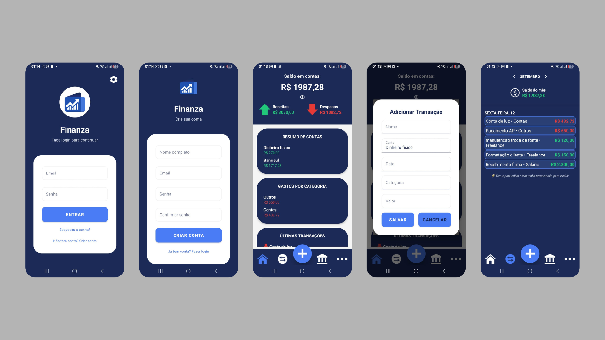
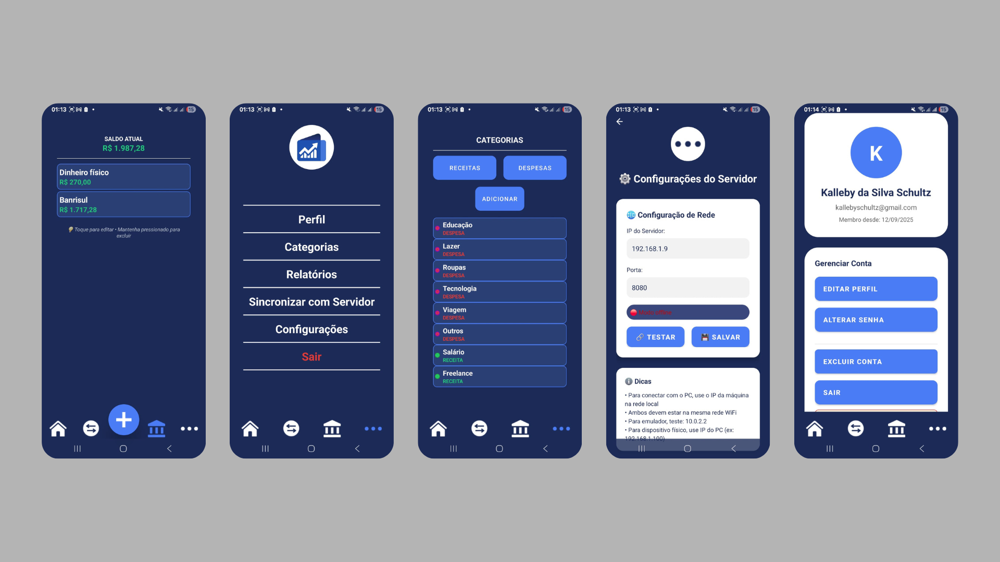

Show! Entendi. Você quer um **README.md completo** para o **Finanza (versão TCC desktop + mobile)**, no mesmo estilo do que fizemos para o **SWGF Web**, mas trazendo todo o peso acadêmico e interdisciplinar descrito no documento que você me passou.

Aqui está o modelo, bem estruturado para GitHub:

---

# 💰 Finanza – Sistema Completo de Controle Financeiro

---

## 📋 Sobre o Projeto

O **Finanza** é um **Sistema de Informação multiplataforma** (Desktop e Mobile) desenvolvido como **Trabalho Interdisciplinar do 4º ano do Curso Técnico em Informática Integrado ao Ensino Médio do IFSUL – Campus Venâncio Aires**.

O projeto integrou conhecimentos adquiridos em várias disciplinas do curso, com o objetivo de entregar um sistema **completo, genuíno, funcional e de caráter acadêmico**, aplicando teoria e prática de forma integrada.

### 📚 Disciplinas Envolvidas

* **Engenharia e Qualidade de Software** – Planejamento, requisitos, documentação, ciclo de vida incremental e diagramas.
* **Gestão e Empreendedorismo** – Modelo de negócios e viabilidade da solução.
* **Linguagem de Programação III** – Versão desktop em Java com banco de dados e comunicação via sockets.
* **Programação para Dispositivos Móveis** – Versão mobile Android conectada ao servidor.
* **Segurança da Informação** – Autenticação, login e troca de senha com criptografia.

---

## 🎯 Objetivos

### Objetivo Geral

Planejar e desenvolver um **sistema de informação completo e interdisciplinar**, único na turma, aplicando competências adquiridas durante a formação.

### Objetivos Específicos

* **Engenharia e Qualidade de Software**: Planejamento e documentação completa do sistema.
* **Gestão e Empreendedorismo**: Construção do modelo de negócios.
* **Linguagem de Programação III**: Implementação da versão desktop em Java.
* **Programação para Dispositivos Móveis**: Implementação da versão mobile em Android.
* **Segurança da Informação**: Aplicação de técnicas de autenticação e criptografia.

---

## ⚡ Funcionalidades

* **Autenticação de usuários** (login, troca de senha criptografada).
* **Dashboard financeiro** com visão geral das contas.
* **Gestão de contas**: corrente, poupança, cartões, investimentos.
* **Gestão de categorias**: personalizadas e com relatórios vinculados.
* **Lançamento de transações** (receitas e despesas).
* **Sincronização em tempo real** entre dispositivos via **sockets TCP/IP**.
* **Histórico de movimentações** com filtros avançados.
* **Relatórios financeiros** exportáveis.
* **Interface Desktop (Java + Swing)**.
* **Aplicativo Mobile (Android)** com suporte a uso offline e posterior sincronização.

---

## 🏗️ Arquitetura

O **Finanza** possui uma arquitetura **cliente-servidor híbrida**:

* **Desktop (Java + MySQL)**

  * Servidor TCP responsável por persistência dos dados.
  * Interface Swing para administração e relatórios.

* **Mobile (Android + Java)**

  * App Android conectado ao servidor via sockets.
  * Funcionalidade *offline-first* com sincronização posterior.

* **Segurança**

  * Autenticação de usuários.
  * Criptografia para senhas.

Fluxo: **Cliente (Android/Desktop) → Socket → Servidor Java/MySQL → Resposta em tempo real**.

---

## 🛠️ Tecnologias Utilizadas

* **Java (JDK 17+)**
* **MySQL** (persistência de dados)
* **Sockets TCP/IP** (comunicação entre clientes e servidor)
* **Android (Java + XML)**
* **Swing (Desktop)**
* **POO / MVC (Desktop) e MVVM (Mobile)**
* **Criptografia (hashing para senhas)**

---

## 📦 Instalação Rápida

### 🔹 Servidor Desktop

1. Clone o repositório
2. Configure o banco MySQL com o script incluído
3. Compile o projeto em Java (NetBeans ou IntelliJ)
4. Execute o **ServidorFinanza**

### 🔹 Aplicativo Mobile

1. Importe o projeto Android no Android Studio
2. Configure o IP do servidor na classe de conexão
3. Compile e instale no dispositivo ou emulador

---

## 📖 Como Usar

1. **Registrar um usuário** no servidor desktop.
2. **Login** pelo desktop ou app mobile.
3. **Cadastrar contas e categorias**.
4. **Lançar transações** (receitas/despesas).
5. **Sincronizar** entre desktop e mobile via servidor.
6. **Gerar relatórios** e acompanhar pelo dashboard.

---

## 👨‍🏫 Contexto Acadêmico

O projeto fez parte de um **trabalho interdisciplinar avaliado em múltiplas etapas**, incluindo:

* **Etapa 1** – Proposta do software.
* **Etapa 2** – Planejamento e documentação (requisitos, diagramas, wireframes).
* **Etapa 3** – Desenvolvimento das versões desktop e mobile.
* **Etapa 4** – Apresentação final e entrega de código-fonte.

### Avaliação

A nota final foi ponderada entre as disciplinas, considerando **qualidade técnica, documentação, funcionalidade, inovação, usabilidade, segurança, design e postura da equipe**.

---

## 📄 Licença

Este software foi desenvolvido para **fins acadêmicos** no **IFSUL – Campus Venâncio Aires**, como parte de um **trabalho interdisciplinar no Curso Técnico em Informática**.
Seu uso é livre para fins educacionais e de aprendizado.

**Desenvolvido por Kalleby Schultz**
